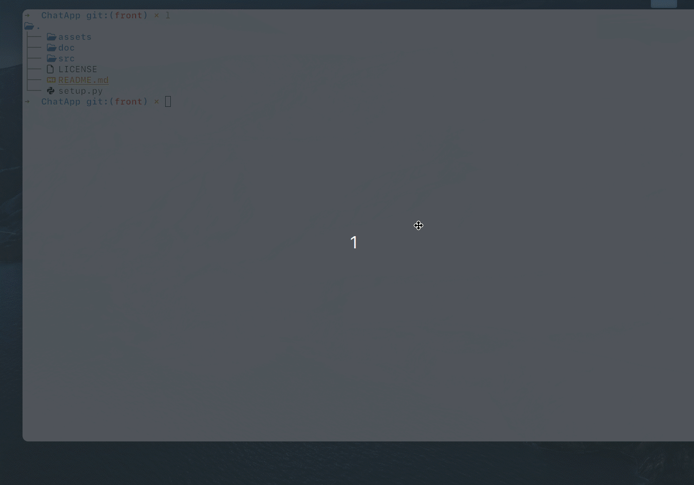
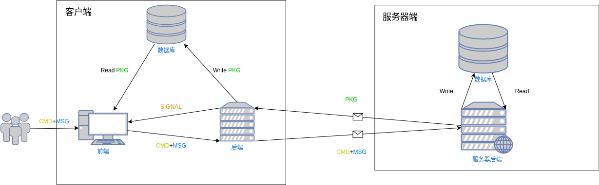
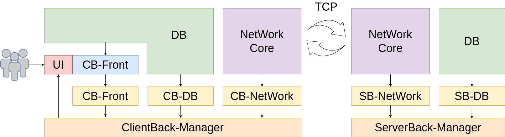

# ChatApp

<!-- toc -->

- [展示](#%E5%B1%95%E7%A4%BA)
  * [登录&聊天](#%E7%99%BB%E5%BD%95%E8%81%8A%E5%A4%A9)
  * [群组管理](#%E7%BE%A4%E7%BB%84%E7%AE%A1%E7%90%86)
  * [引导程序](#%E5%BC%95%E5%AF%BC%E7%A8%8B%E5%BA%8F)
- [框架](#%E6%A1%86%E6%9E%B6)
  * [整体框架](#%E6%95%B4%E4%BD%93%E6%A1%86%E6%9E%B6)
  * [细化框架](#%E7%BB%86%E5%8C%96%E6%A1%86%E6%9E%B6)
- [数据流](#%E6%95%B0%E6%8D%AE%E6%B5%81)
  * [数据表](#%E6%95%B0%E6%8D%AE%E8%A1%A8)
    + [Client](#client)
      - [字段](#%E5%AD%97%E6%AE%B5)
      - [CSV例子](#csv%E4%BE%8B%E5%AD%90)
    + [Server](#server)
  * [数据报格式](#%E6%95%B0%E6%8D%AE%E6%8A%A5%E6%A0%BC%E5%BC%8F)
  * [登录流程](#%E7%99%BB%E5%BD%95%E6%B5%81%E7%A8%8B)
  * [发送检查](#%E5%8F%91%E9%80%81%E6%A3%80%E6%9F%A5)
    + [client](#client)
  * [接受执行](#%E6%8E%A5%E5%8F%97%E6%89%A7%E8%A1%8C)
    + [client](#client-1)
    + [server](#server)
  * [退出流程](#%E9%80%80%E5%87%BA%E6%B5%81%E7%A8%8B)
- [TODO](#todo)

<!-- tocstop -->

## 展示

### 登录&聊天


### 群组管理


### 引导程序



## 框架

### 整体框架



### 细化框架



## 数据流

### 数据表

#### Client

客户端的数据库主要是便于前后端交互以及前端显示数据。只有前端需要的数据是被需要的和被许可获取的。

##### 字段

1. current_groups.csv：记录所有在线的群组

```json
{
    "name": "群组名，小于15chars",
    "type": "public/private",
}
```

2. gourps.csv：记录所有和当前用户有关的用户名

```json
{
    "name": "群组名，小于15chars",
    "owner": "用户名（考虑改成是否是自己：Yes or No）"
}
```

3. users.csv：当前在线的所有用户

```json
{
    "name": "用户名"
}
```

4. message.csv：该用户收到的所有消息列表

```json
{
    "timestamp":"时间戳",
    "source":"发送者",
    "target":"接收者",
    "type":"内容类型",
    "content":"内容",
    "message_type":"消息类型"
}
```


##### CSV例子

1. current_groups.csv:

```csv
name,type

Public,public
ChatBox,private
ChatBox2,private
ChatBox3,public
ChatBox4,public
ChatBox5,public
ChatBox6,private
ChatBox7,private
ChatBox8,public
ChatBox9,public
ChatBox10,private
ChatBox11,public
```

2. groups.csv

```csv
name,owner

Public,Server
ChatBox,Yunming Hu
ChatBox2,ZQX
ChatBox3,Yunming Hu
ChatBox4,ZQX
```

3. message.csv

```csv
"timestamp","source","target","type","content","message_type"

"2024-12-05T13:46:04.462684","ZQX","ChatBox","text","hello","group"
"2024-12-05T13:46:13.479885","ZQX","ChatBox","picture","./pictures/show.gif","group"
"2024-12-05T15:44:24.666147","Yunming Hu","Public","text","公式范德萨发送实得分数大幅度萨菲士大夫实得分数的分尸案分身乏术方式方法士大夫撒旦放大算法撒放大说法的三番四复大师傅第三方额附加阿斯顿里飞鸟时代封建时代卡拉福克斯的参数拿出来你积分考虑到萨满蚕蛾农夫呢为您服务那里积分卡拉三年搭茬儿；。发送单发","group"
"2024-12-05T15:51:54.684300","Yunming Hu","Public","picture","./pictures/develop.gif","group"
"2024-12-05T16:02:50.648827","Yunming Hu","ChatBox","text","hello","group"
"2024-12-05T16:07:58.434143","Yunming Hu","ChatBox","text","hello","group"
```

4. users.csv

```csv
name

ZQX
Yunming Hu
```

#### Server

Server维护的东西有：

1. 所有的在线用户的{用户名:FullDuplex对象}字典。
2. 维护群组有关信息的{群组：用户列表,属性s}字典。

具体维护的东西如下：

- 群组字典

```python
Groups = {
    "group1": {
        "type": Enum.private,
        "max_scale": 50,  // 最多容纳的用户数，即用户列表的最大长度。
        "password": "123456",
        "owner": "somebody",
        "group1": [
            "user1", 
            "user2"
        ],
    },
    "group2": {
        "type": Enum.private,
        "max_scale": 150,  // 最多容纳的用户数，即用户列表的最大长度。
        "password": "hhh123456",
        "owner": "somebody",
        "group2": [
            "user2",
            "user3",
            ...
        ],
    },
    ...
}
```

- 用户-FullDuplex对象

```python
Users = {
    "user1": FullDuplex1,
    "user2": FullDuplex2,
    ...
}
```

- 就绪队列

由用户名组成，方便调用相应的FullDuplex实例来完成任务。过程是：从就绪队列中取出用户名，从对应的FullDuplex1取出一条消息，执行这一条消息。要加读写锁，由每一个handle_client线程(push)和主任务线程竞争（get）。


### 数据报格式

数据报分成4种，分别是TEXT，FILE，IMAGE，CMD。其格式如下：

```python
{
    'type' (int):
        The message type, where:
        1 - Text: FullDuplex.ProtocalHead.TEXT
        2 - File: FullDuplex.ProtocalHead.FILE
        3 - Image: FullDuplex.ProtocalHead.IMAGE
        4 - Command: FullDuplex.ProtocalHead.CMD
    'source' (str):
        The sender's nickname or group name.
        ! Or 'Server': to emit the CMD to update user_table & group_table of client. Sent two files.
    'target' (str):
        The receiver's nickname or group name.
    'timestamp' (str):
        The formatted timestamp, which must be generated using `get_timestamp()` method.
    'message_type' (str):
        Either "single" or "group", indicating whether the message is sent to one recipient or multiple.
    'content' (str | dict):
        The message content, as follows:
        - If 'type' == 1 (text), 'content' should be the text message (string).
        - If 'type' == 2 (file) or 'type' == 3 (image), 'content' should be a dictionary containing:
        {
            'file_name' (str): The name of the file or image.
            'file_path' (str): The path to the file or image.
        }
        - If 'type' == 4 (command), 'content' should be a dictionary containing:
        {
            'command' (int): The command to be executed. (enum)
            'args' (list): A list of arguments for the command.
        }
}
```

另外，CMD的类型有如下，以及对应的描述：

| CMD id | Type      | name                  | args                             |                         discription                          |
| ------ | --------- | --------------------- | -------------------------------- | ---------------------------------------------------------- |
| 1      | C2S       | Create Group          | type, max_scale, password, owner | Client想要创建群组，Server要添加对应的项，创建完后提醒所有人更新 |
| 2      | S2C       | Update Created Group  | name, owener, password           | Server提醒所有Client更新group.csv & current_groups.csv，需要name，type，owner |
| 3      | C2S       | Quit Group            | gourp_name,user_name             |                 从群组字典对应项中移除这个人                 |
| 4      | S2C       | Quited Group          | signal                |    已经退出，只对对应的用户发送；用户收到后修改groups.csv    |
| 5      | C2S       | Join Group            | gourp_name,user_name,passward    |               则发送请求到Server验证并作出修改               |
| 6      | S2C       | Joined Group          | signal,group_name,type           |  是否加入成功，只对对应的用户发送；用户收到后修改gourps.csv  |
| 7      | C2S       | Move Owner            | gourp_name,user_name             | 转移所有权，Server收到后检查是否有权限执行，有权限则执行（一般有权限才能点），转移给user_name，否则Pass |
| 8      | S2C       | Moved Group           | signal                           |                         转移成功没有                         |
| 9      | S2C       | Moved to you          | signal,group_name                |              转移给你了，Client直接修改必须接受              |
| 10     | C2S       | Delete Group          | group_name                       |              删除群，要给所有人转发，gourp_name              |
| 11     | S2C       | Update Deleted  Group | group_name                       | Server提醒所有Client更新group.csv & current_groups.csv，需要name，type，owner |
| 12     | S2C       | Created User          | user_name                        |               Server提醒所有Client更新user.csv               |
| 13     | S2C       | Deleted User          | user_name                        |               Server提醒所有Client更新user.csv               |
| 14     | S2C       | Deleted Group         | signal               |                         删除成功没有                         |
| 15     | S2C       | Created Group         | signal                |                         创建成功没有                         |


### 登录流程

Client创建实例时会向Server发送请求，Server接到请求后创建实例，如果连接成功这时候就应该都进去了，Client开启循环线程get实例的消息。

- Server要先把当前用户列表和当前群组列表发送给Client，都使用超长文本的方式传输，传输完之后向所有的用户发送CMD12。

- Client循环get收到之后看到类型是TEXT且检查source如果是Server的话就解析并以高效的方式写入数据库。

### 发送检查

主要是本地查错功能，确保发送到Server端的数据没有类似于没有用户和群组的数据问题：

#### client

1. TEXT/FILE/IMAGE

这里直接发就行。

2. CMD

| CMD id | operations                                 |
| ------ | ------------------------------------------ |
| 1      | /                                          |
| 3      | 查看是不是在这个群组中，是才能退           |
| 5      | 查看是否已经在这个群组之中，不在才可以加入 |
| 7      | 检查是否有对群组转移权，有就把gourps.csv对应的项修改       |
| 10     | 同上                                       |


### 接受执行

#### client

1. TEXT/FILE/IMAGE

由于FullDuplex会保存文件，所以这里直接按照格式，以时间为顺序（直接字典序比较即可）二分写入消息队列即可。

2. CMD

| CMD id | operations                                                   |
| ------ | ------------------------------------------------------------ |
| 2      | 把name和type写入current_groups.csv；把name和owner写入groups.csv |
| 4      | signal显示OK修改groups.csv：把对应的项从其中删除；显示Error则报错 |
| 6      | signal显示OK修改groups.csv：把对应的groups_name和type加入其中；显示PasswordError，Member Max，报相应的错 |
| 8      | 如果成功就把gourps.csv对应的项改成相应的名字，否则报错                                              |
| 9      | 修改gourps.csv的owner为自己的用户名                          |
| 11     | 把对应的项从groups.csv和current_groups.csv中移除             |
| 12     | 添加user_name到users.csv                                     |
| 13     | 删除user_name到users.csv                                     |
| 14     | 报错Delete失败                                               |
| 15     | 报错Create失败                                               |


#### server

这里展示的是主线程从就绪队列中拿到处理序号之后的事情。

1. TEXT/FILE/IMAGE

- 查看消息类型：
  - individual：调用对应的用户实例发送消息
  - group：获取的Gourps用户列表并遍历发送消息
- 执行完后查看内容类型：
  - 如果是File/IMAGE就删除对应的文件以免占用空间

3. CMD

| CMD id | operations                                                   |
| ------ | ------------------------------------------------------------ |
| 1      | 根据发送来的消息为Groups创建新的项，并转发所有的用户CMD2，向原始用户发送CMD15；失败则向原始用户发送CMD15 |
| 3      | 从群组中移除这个人，并向这个人发送CMD4                       |
| 5      | 1，如果是public，验证是否超过人数上限，如果超过，发送CMD6给对应的用户，signal=Max Member；否则加入这个人并发送CMD6<br />2，如果是private，验证密码，错误发送CMD6给对应的用户signal=Password Error；否则验证是否超过人数上限，如果超过，发送CMD6给对应的用户，signal=Max Member；否则加入这个人并发送CMD6 |
| 7      | 把对应的群组owner改成修改后的user_name，如果没有这个修改之后的人则发送CMD8：No Such User；有这个人则向之前的user发送CMD8，向修改后的user发送CMD9 |
| 10     | 先获取对应群组的用户列表，然后向所有的用户发送CMD11，向原始用户发送CMD14；失败则向原始用户发送CMD14 |

### 退出流程

Server检测到退出之后，删除用户列表中对应的项，并向所有的用户发送CMD13。


## TODO

TODO List:

```cpp
.
├── setup.py (#New，引导程序)
└── src
    ├── client
    │   ├── (ignored)data (存放记录数据库)
    │   │   └── ${USER NAME}
    │   ├── front
    │   │   ├── assets
    │   │   │   ├── fonts (#New，Cache 字体)
    │   │   │   │   ├── AnonymiceProNerdFontPropo-Regular.ttf
    │   │   │   │   ├── Manjari-Regular.otf
    │   │   │   │   └── NotoSerifSC-Regular.ttf
    │   │   │   └── pictures
    │   │   │       ├── 1.png
    │   │   │       ├── 1.svg
    │   │   │       ├── 2.png
    │   │   │       └── 3.png
    │   │   ├── css
    │   │   │   ├── group_management.css
    │   │   │   ├── login.css
    │   │   │   ├── main.css
    │   │   │   └── style.css
    │   │   ├── (ignored)data
    │   │   │   ├── current_groups.csv (#New，存放在线群组名，用于加入权@1)
    │   │   │   ├── groups.csv
    │   │   │   ├── message.csv
    │   │   │   ├── users.csv
    │   │   │   ├── file
    │   │   │   │   └── files
    │   │   │   └── picture
    │   │   │   │   └── pictures
    │   │   ├── group_management.html
    │   │   ├── index.html
    │   │   ├── js
    │   │   │   ├── group_management.js (#4)
    │   │   │   ├── login.js
    │   │   │   └── main.js
    │   │   └── main.html
    │   ├── ClientDatabase.py (#DOING)
    │   ├── ClientManager.py (*)
    │   ├── ClientNetwork.py (#5)
    │   └── setup.py (*)
    ├── server
    │   ├── (ignored)server_data
    │   │   └── message_queue.csv
    │   ├── ServerDatabase.py (*)
    │   ├── ServerManager.py (*)
    │   ├── ServerNetwork.py (*)
    │   └── setup.py (*, #3)
    └── utils
        └── core.py (#1)
```

```cpp
* = TODO all

#New = 新添加的部分
#DOING = 按照数据包格式写入本地消息队列，这里不用保存文件因为这是CB-NetWork的任务。
#1:(@1) = 把命令做成枚举类
#2:(all) = 完善交互式命令行入口。
#3 = 将用户更新命令省去，用Server发出的json流代替传输(json: 减少读写文件带来的磁盘IO，
     因为要根据不同的用户确定不同的群组发送内容)。
#4:(#5) = 完成Client群组管理前端的接口实现。
#5 = 完成Client群组管理后端的接口实现。
@1 = 聊天室模型：
   1，聊天室设置密码。
   2，聊天室只有创建权，销毁权（创建者）和进出权（所有人），没有编辑权「主动使人加入的权限」。
   3，只有一个人有所有权，可以主动转移；
      在所有者退出的时候会自动从用户列表中选取一个人来继承权限；
      如果群组没有人会被自动销毁。
   4，公共聊天室无密码，所有用户可无密码加入，所有人不具有所有权。
   5，（创建权）：添加在线成员；设置密码（不可以空）；设置聊天室名称（不可以空）；
      （销毁权）：删除聊天室。
   7，（进出权）：加入，退出聊天室。
@2 = 完善错误处理列表。

%1(release v1.0.0): 完善文档
```

## 测试

测试在`./test/`下，分为前端和后端两个部分。前端测试在`./test/frontend/`下，后端测试在`./test/backend/`下，被测试模块通过软链接添加，具体可以看代码。

### 前端测试条目


### 后端测试条目

#### core.py(NetWork Core)
#### ClientDatabase.py(CB-DB)

