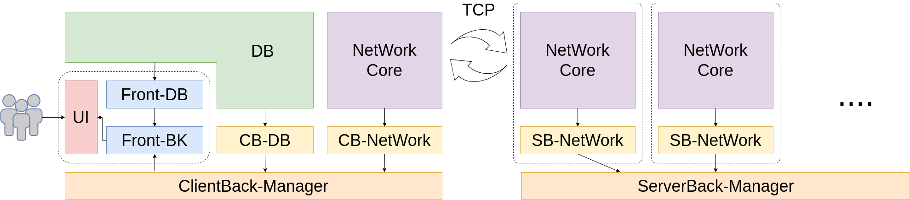

# ChatApp

## 展示

### 登录&聊天


### 群组管理


### 引导程序


## 框架

### 整体框架


### 细化框架



## 细节

### 数据表和ER图

#### Client

设计理念：Client只获取和自己有关的数据，不能冗余(获得某一类数据却从不使用)。
其中：

- 前端自发只读：`groups.csv`、`users.csv`、`current_groups.csv`、`message.csv`。
- 后端自发读：`groups.csv`、`users.csv`，写：`message.csv`。
- `users.csv`，`current_groups.csv`，`groups.csv`都由服务器发送过来的请求更新。

读写权限表如下：

| 对象\文件      | groups.csv | users.csv | current_groups.csv | message.csv |
| -------------- | ---------- | --------- | ------------------ | ----------- |
| Client Front   | R          | R         | R                  | R           |
| Client Back    | R          | R         | \                  | W           |
| Server Request | W          | W         | W                  | \           |


CSV例子如下：

1. current_groups.csv:

```csv
name,type

Public,public
ChatBox,private
ChatBox2,private
ChatBox3,public
ChatBox4,public
ChatBox5,public
ChatBox6,private
ChatBox7,private
ChatBox8,public
ChatBox9,public
ChatBox10,private
ChatBox11,public
```

2. groups.csv

```csv
name,owner

Public,Server
ChatBox,Yunming Hu
ChatBox2,ZQX
ChatBox3,Yunming Hu
ChatBox4,ZQX
```

3. message.csv

```csv
"timestamp","source","target","type","content","message_type"

"2024-12-05T13:46:04.462684","ZQX","ChatBox","text","hello","group"
"2024-12-05T13:46:13.479885","ZQX","ChatBox","picture","./pictures/show.gif","group"
"2024-12-05T15:44:24.666147","Yunming Hu","Public","text","公式范德萨发送实得分数大幅度萨菲士大夫实得分数的分尸案分身乏术方式方法士大夫撒旦放大算法撒放大说法的三番四复大师傅第三方额附加阿斯顿里飞鸟时代封建时代卡拉福克斯的参数拿出来你积分考虑到萨满蚕蛾农夫呢为您服务那里积分卡拉三年搭茬儿；。发送单发","group"
"2024-12-05T15:51:54.684300","Yunming Hu","Public","picture","./pictures/develop.gif","group"
"2024-12-05T16:02:50.648827","Yunming Hu","ChatBox","text","hello","group"
"2024-12-05T16:07:58.434143","Yunming Hu","ChatBox","text","hello","group"
```

4. users.csv

```csv
name

ZQX
Yunming Hu
```

#### Server


## TODO

TODO List:

```cpp
.
├── setup.py (#New，引导程序)
└── src
    ├── client
    │   ├── (ignored)data (存放记录数据库)
    │   │   └── ${USER NAME}
    │   ├── front
    │   │   ├── assets
    │   │   │   ├── fonts (#New，Cache 字体)
    │   │   │   │   ├── AnonymiceProNerdFontPropo-Regular.ttf
    │   │   │   │   ├── Manjari-Regular.otf
    │   │   │   │   └── NotoSerifSC-Regular.ttf
    │   │   │   └── pictures
    │   │   │       ├── 1.png
    │   │   │       ├── 1.svg
    │   │   │       ├── 2.png
    │   │   │       └── 3.png
    │   │   ├── css
    │   │   │   ├── group_management.css
    │   │   │   ├── login.css
    │   │   │   ├── main.css
    │   │   │   └── style.css
    │   │   ├── (ignored)data
    │   │   │   ├── current_groups.csv (#New，存放在线群组名，用于加入权@1)
    │   │   │   ├── groups.csv
    │   │   │   ├── message.csv
    │   │   │   ├── users.csv
    │   │   │   ├── file
    │   │   │   │   └── files
    │   │   │   └── picture
    │   │   │   │   └── pictures
    │   │   ├── group_management.html
    │   │   ├── index.html
    │   │   ├── js
    │   │   │   ├── group_management.js (#4)
    │   │   │   ├── login.js
    │   │   │   └── main.js
    │   │   └── main.html
    │   ├── ClientDatabase.py (#DOING)
    │   ├── ClientManager.py (*)
    │   ├── ClientNetwork.py (#5)
    │   └── setup.py (*)
    ├── server
    │   ├── (ignored)server_data
    │   │   └── message_queue.csv
    │   ├── ServerDatabase.py (*)
    │   ├── ServerManager.py (*)
    │   ├── ServerNetwork.py (*)
    │   └── setup.py (*, #3)
    └── utils
        └── core.py (#1)
```

```cpp
* = TODO all

#New = 新添加的部分
#DOING = 按照数据包格式写入本地消息队列，这里不用保存文件因为这是CB-NetWork的任务。
#1:(@1) = 把命令做成枚举类
#2:(all) = 完善交互式命令行入口。
#3 = 将用户更新命令省去，用Server发出的json流代替传输(json: 减少读写文件带来的磁盘IO，
     因为要根据不同的用户确定不同的群组发送内容)。
#4:(#5) = 完成Client群组管理前端的接口实现。
#5 = 完成Client群组管理后端的接口实现。
@1 = 聊天室模型：
   1，聊天室设置密码。
   2，聊天室只有创建权，销毁权（创建者）和进出权（所有人），没有编辑权「主动使人加入的权限」。
   3，只有一个人有所有权，可以主动转移；
      在所有者退出的时候会自动从用户列表中选取一个人来继承权限；
      如果群组没有人会被自动销毁。
   4，公共聊天室无密码，所有用户可无密码加入，所有人不具有所有权。
   5，（创建权）：添加在线成员；设置密码（不可以空）；设置聊天室名称（不可以空）；
      （销毁权）：删除聊天室。
   7，（进出权）：加入，退出聊天室。
@2 = 完善错误处理列表。

%1(release v1.0.0): 完善文档
```
